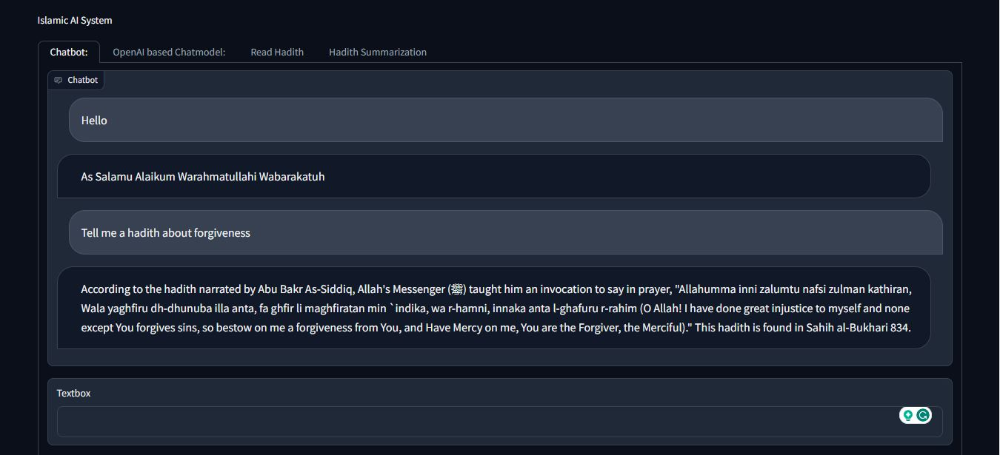
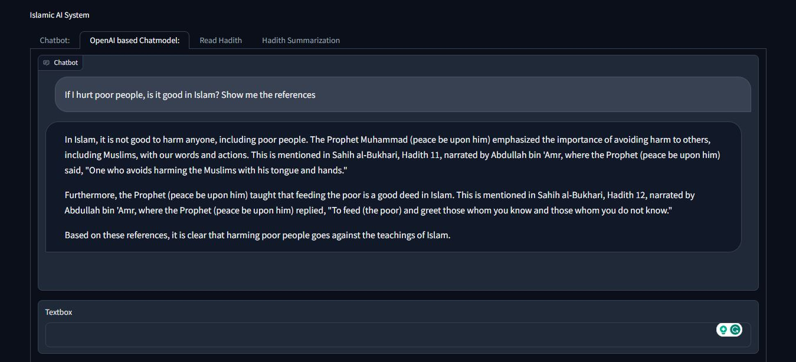
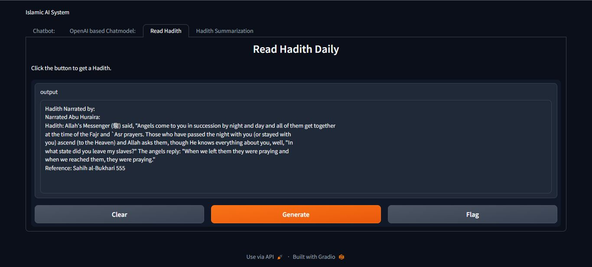
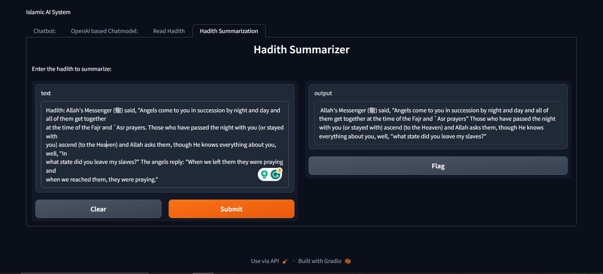

# Islamic_AI_Chatbot_System
<h3>Here I provide the UI design of my project</h3>

This is a question answering chatbot

This is another chatbot with OpenAI chat model

People can read hadith at any time by clicking generate button 

People can get the short version of any hadith anytime

